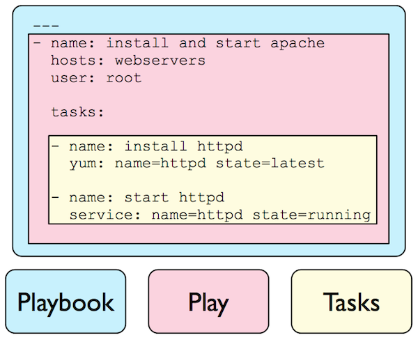
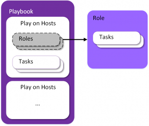
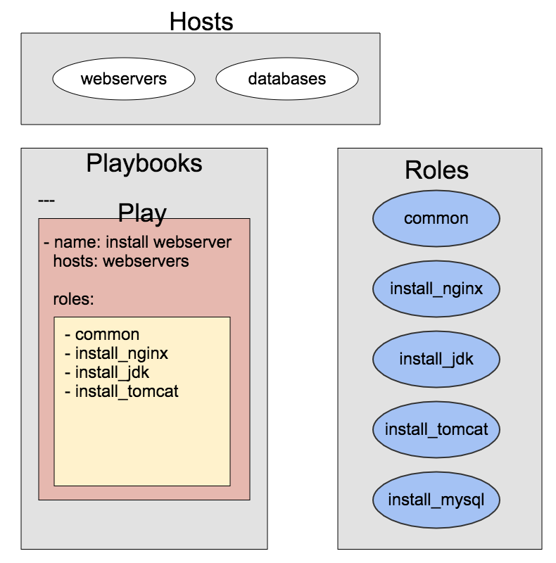

# Playbooks

## Playbook 이란?

> Playbooks - play - tasks 구조 #1



> Playbooks - play - Roles 구조



> Playbooks - Hosts - Roles 관계




## 문법의 변화

특정 버전에서 부터 문법이 달라졌다. 두개 모두 사용이 가능하다.

file 모듈을 예로 들자면

> 변경 전

```yaml
- file: path=/etc/foo.conf owner=foo group=foo mode=0644
```

> 변경 후

```Yaml
- file:
    path: /etc/foo.conf
    owner: foo
    group: foo
    mode: 0644
```

### 기타

- `YAML` 파일 작성 시 들여쓰기는 `TAB` 이 아닌 `Space`로 할 것
- {{변수}} 가 있는 곳은 " "로 감쌀 것


```Yaml
- file:
    path: "/etc/{{filename}}.conf"
    owner: foo
    group: foo
    mode: 0644
```


## 미리 준비할 것들

### ansible.cfg

테스트가 용이하게 기본적인 환경설정을 하자.  
http://docs.ansible.com/ansible/intro_configuration.html

```properties
[defaults]
forks = 50 
host_key_checking = False
remote_user = deploy
remote_port = 22

roles_path = ./roles
```


## 공통 변수

공통 변수를 파일로 관리하여 각 Playbook 에서 사용할 수 있다.

> group_vars/common.yml

```yaml
user_id: jacob
nginx:
  version: nginx-1.12.1
  download_url: https://nginx.org/download/{{nginx.version}}.tar.gz
```


## 디렉토리 구조

> 디렉토리 생성

```Sh
$ mkdir -p group_vars hosts playbooks roles
```

```
- group_vars
- hosts
- playbooks
- roles
ansible.cfg
```


## 기본 설정

> playbook을 사용하지 않는 명령어

```Sh
$ ansible all -i hosts/admin -m ping
```

playbook 으로 변환

> vi playbooks/basic.yml

```yaml
---
- name: test ping
  vars_files:
    - ../group_vars/common.yml
  hosts: all
  tasks:
    - name: test connection
      ping:
```

> 실행

```Sh
$ ansible-playbook playbooks/basic.yml -i hosts/admin -l alpha
```


## (실습) 기본 설정 - 좀 더 테스트 해보자

각 서버에 접속하여 `/home/deploy` 에 `touch {본인이름}.txt` 하는 것을 구현해 보자  
touch는 file 모듈을 활용하면 된다.  File 모듈에 대해 자세히 보려면 [여기][1]를 참고하라.

[1]: http://docs.ansible.com/ansible/latest/file_module.html

> vi playbook/touch_files.yml

```Yaml
---
- name: test ping
  vars_files:
    - ../group_vars/common.yml
  hosts: all
  tasks:
    - name: make directory
      file:
        path: /home/deploy/touch_files
        state: directory
        
    - name: touch file
      file:
        path: /home/deploy/touch_files/jacob.txt
        state: touch
```

> 실행

```sh
$ ansible-playbook playbooks/touch_files.yml -i hosts/admin
```


### (실습) 변수 활용 (vars, {{변수명}})

위에 설정을 보면 `/home/deploy/touch_files` 이 중복된다. 변수를 활용하면 깔끔하겠죠?
변수를 사용할 때는 `{{variables}}` 형태로 사용하면 된다.

> vi playbook/touch_files.yml

```yaml
---
- name: test ping
  vars_files:
    - ../group_vars/common.yml
  hosts: all
  vars:
    touch_files_path: /home/deploy/touch_files
    id: jacob
  tasks:
    - name: make directory
      file:
        path: "{{touch_files_path}}"
        state: directory
        
    - name: touch file
      file:
        path: "{{touch_files_path}}/{{id}}.txt"
        state: touch
```

> 실행

```sh
$ ansible-playbook playbooks/touch_files.yml -i hosts/admin
```


### (실습) 루프를 이용하여 여러 파일들을 생성해 보자 (item, with_items)

`{본인이름}[1-3].txt` 을 생성해 보자

> vi playbook/touch_files.yml

```yaml
---
- name: test ping
  vars_files:
    - ../group_vars/common.yml
  hosts: all
  vars:
    touch_files_path: /home/deploy/touch_files
    id: jacob
  tasks:
    - name: make directory
      file:
        path: "{{touch_files_path}}"
        state: directory
        
    - name: touch files
      file:
        path: "{{touch_files_path}}/{{item}}.txt"
        state: touch
      with_items:
        - "{{id}}1"
        - "{{id}}2"
        - "{{id}}3"
```

> 실행

```sh
$ ansible-playbook playbooks/touch_files.yml -i hosts/admin
```


or

> vi playbook/touch_files.yml

```yaml
---
- name: test ping
  vars_files:
    - ../group_vars/common.yml
  hosts: all
  vars:
    touch_files_path: /home/deploy/touch_files
    id: jacob
  tasks:
    - name: make directory
      file:
        path: "{{touch_files_path}}"
        state: directory
        
    - name: touch files
      file:
        path: "{{touch_files_path}}/{{item.id}}{{item.num}}.txt"
        state: touch
      with_items:
        - {id: "{{id}}", num: 1}
        - {id: "{{id}}", num: 2}
        - {id: "{{id}}", num: 3}
```

> 실행

```sh
$ ansible-playbook playbooks/touch_files.yml -i hosts/admin
```


### (실습) 조건문도 설정해볼까 (when)

> http://docs.ansible.com/ansible/latest/playbooks_conditionals.html 

CentOS 이며 버전이 7일 경우에만 실행되게 해보자

> vi playbook/touch_files.yml

```Yaml
---
- name: test ping
  vars_files:
    - ../group_vars/common.yml
  hosts: all
  vars:
    touch_files_path: /home/deploy/touch_files
    id: jacob
  tasks:
    - name: make directory
      file:
        path: "{{touch_files_path}}"
        state: directory
        
    - name: touch file
      file:
        path: "{{touch_files_path}}/{{item}}.txt"
        state: touch
      with_items:
        - "{{id}}1"
        - "{{id}}2"
        - "{{id}}3"
      when:
        - ansible_distribution == "CentOS"
        - ansible_distribution_major_version == "7"
        #- (ansible_distribution == "CentOS" and ansible_distribution_major_version == "7")
```

> 실행

```sh
$ ansible-playbook playbooks/touch_files.yml -i hosts/admin
```


## (실습) 파일이 존재하면 실행하고 없으면 실행되게 해보자 (stat, register, when)

> Stat 모듈 : http://docs.ansible.com/ansible/latest/stat_module.html


> vi playbook/touch_files.yml

```Yaml
---
- name: test ping
  vars_files:
    - ../group_vars/common.yml
  hosts: all
  vars:
    touch_files_path: /home/deploy/touch_files
    id: jacob
  tasks:
    - name: make directory
      file:
        path: "{{touch_files_path}}"
        state: directory
        
    - stat:
        path: "{{touch_files_path}}/jacob.txt"
       register: result
    
    - name: touch file
      file:
        path: "{{touch_files_path}}/{{item}}.txt"
        state: touch
      with_items:
        - "{{id}}1"
        - "{{id}}2"
        - "{{id}}3"
      when:
        - not result.stat.exists
        #- result.stat.exists == false
```

>실행

```sh
$ ansible-playbook playbooks/touch_files.yml -i hosts/admin
```


## Ansible의 핵심 Role

- 중복 소스 제거
- 자주 사용하는 것들은 Role 로 만듬
- 미리 레시피를 만들어 놓고 호출만 하면 끝!

### 프로젝트 구조 예

```
site.yml
webservers.yml
fooservers.yml
roles/
   common/
     files/
     templates/
     tasks/
     handlers/
     vars/
     defaults/
     meta/
   webservers/
     files/
     templates/
     tasks/
     handlers/
     vars/
     defaults/
     meta/
```

호출은 이렇게

```yaml
---
- hosts: webservers
  roles:
    - common
    - webservers
```

변수나 조건 설정을 할 경우

```Yaml
---
- hosts: webservers
  roles:
    - {role: touch_files, touch_files_path: '/home/deploy/touch_files'}
    - {role: touch_files, touch_files_path: '/home/deploy/touch_files', when: "ansible_os_family == 'RedHat'"}
```


### (실습) Role 생성

위에서 진행했던 playbook인 touch_files.yml에 있던 tasks를 role로 빼보자

> main.yml 은 index.html 같은 개념

```Sh
$ mkdir -p roles/touch_files/tasks/main.yml
```

> vi roles/touch_files/tasks/main.yml

```Yaml
---
- name: make directory
  file:
    path: "{{touch_files_path}}"
    state: directory
    
- stat:
    path: "{{touch_files_path}}/jacob.txt"
  register: result

- name: touch file
  file:
    path: "{{touch_files_path}}/{{item}}.txt"
    state: touch
  with_items:
    - "{{id}}1"
    - "{{id}}2"
    - "{{id}}3"
  when:
    - result.stat.exists == false
```

> vi playbooks/touch_files_role.yml

```yaml
---
- name: test ping
  vars_files:
    - ../group_vars/common.yml
  hosts: all
  vars:
    touch_files_path: /home/deploy/touch_files
    id: jacob
  roles:
    - touch_files
```

or

```yaml
- name: test ping
  vars_files:
    - ../group_vars/common.yml
  hosts: all
  roles:
    - {role: touch_files, touch_files_path: /home/deploy/touch_files, id: jacob}
```

> 실행

```Sh
$ ansible-playbook playbooks/touch_files_role.yml -i hosts/admin -l alpha
```


## (팁) Variables

***{{variables}}*** 형태로 사용

### 변수 사용은 여러가지 방법이 있다

#### 공통 파일로 관리

> group_vars/common.yml

```yaml
git:
  version: git-2.13.0
  download_url: https://www.kernel.org/pub/software/scm/git
nginx:
  version: nginx-1.12.1
  download_url: https://nginx.org/download/nginx-1.12.1.tar.gz
```

> playbooks/install_nginx.yml

```Yaml
---
- hosts: all
  vars_files:
    - ../../group_vars/common.yml
  roles:
  	- install_nginx
```

#### Hosts 에서 관리

> hosts/admin

```json
[web]
ansible-test-web01	nginx_version=nginx-1.12.1
ansible-test-web02  nginx_version=nginx-1.12.1

[db]
ansible-test-db01
```

#### Playbook에서 관리

> playbooks/install_nginx.yml

```yaml
---
- hosts: all
  vars:
    - nginx:
        - version: nginx-1.12.1
        - download_url: https://nginx.org/download/nginx-1.12.1.tar.gz
  roles:
    - install_nginx
```

#### Roles 의 vars 에서 관리

> roles/install_nginx/vars/main.yml

```Yams
- nginx:
  - version: nginx-1.12.1
  - download_url: https://nginx.org/download/nginx-1.12.1.tar.gz
```


## (팁) Playbook 안에 Playbook

> playbook/site.yml

```Yaml
---
- include: webservers.yml
- include: dbservers.yml
```

> webservers.yml

```yaml
---
- hosts: webservers
  roles:
    - common
    - webtier
```

> 실행

```Sh
$ ansible-playbook site.yml --limit webservers
$ ansible-playbook webservers.yml
```


## (팁) sudo

sudo 권한이 필요할 경우 `sudo: true` 옵션을 주면 된다.

```yaml
- name: copy foo.conf
  sudo: true
  copy:
    src: /home/deploy/foo.conf
    dest: /etc/foo.conf
    
```


## (실습) Templates 활용

http://docs.ansible.com/ansible/latest/template_module.html

템플릿에 ***{{variables}}*** 를 설정할 수 있다.

### Template 을 이용하여 파일을 복사 해보자

디렉토리 생성

```Sh
$ mkdir -p roles/test_templates/tasks
$ mkdir tasks templates vars
```

> roles/test_templates/vars/main.yml

```yaml
templates_dir_path: /home/deploy/templates_test
user_id: jacob
```

> roles/test_templates/templates/test.txt

```
- user_id: {{user_id}}
- templates_dir_path: {{templates_dir_path}}
- hostname: {{inventory_hostname}}
```

> roles/test_templates/tasks/main.yml

```yaml
---
- name: make directory
  file:
    path: "{{templates_dir_path}}"
    state: directory
    
- name: copy test.text
  template:
    src: test.txt
    dest: "{{templates_dir_path}}/{{user_id}}.txt"
```

> playbooks/test_templates.yml

```Yaml
---
- name: test ping
  vars_files:
    - ../group_vars/common.yml
  hosts: all
  roles:
    - test_templates
```

> 실행

```
$ ansible-playbook playbooks/test_templates.yml -i hosts/admin -l alpha
```


### templates 디렉토리 위치 변경

각 `role` 마다 `templates` 안에 템플릿들을 관리하는 것 보다 한 디렉토리 안에서 관리하는게 편할것이다.  
이럴 경우 아래와 같이 설정하면 된다.

> templates 디렉토리 생성 및 파일 복사

```sh
$ mkdir templates
$ cp roles/test_templates/templates/test.txt templates/
```

> roles/test_templates/tasks/main.yml

```Yaml
---
- name: make directory
  file:
    path: "{{templates_dir_path}}"
    state: directory
    
- name: copy test.text
  template:
    src: ../../../templates/test.txt
    dest: "{{templates_dir_path}}/{{user_id}}.txt"
```

group_vars 에 등록하면 더 유용. 이렇게 해보자

> group_vars/common.yml 에 추가

```Yaml
templates_path: ../../../templates
```

> roles/test_templates/tasks/main.yml

```yaml
---
- name: make directory
  file:
    path: "{{templates_dir_path}}"
    state: directory
    
- name: copy test.text
  template:
    src: "{{templates_path}}/test.txt"
    dest: "{{templates_dir_path}}/{{user_id}}.txt"
```


## (팁) SSH authorized key

현재까지 로컬에서 테스트를 했습니다.  
그러나 서버 to 서버 형태로 가면 SSH 인증키 등록 작업을 선행되어야 합니다.  
SSH 인증키에 대한 이해 : https://opentutorials.org/module/432/3742

> 인증키 등록 예제

```yaml
# 로컬 서버의 ~/.ssh/id_rsa.pub의 내용을 접근 대상 서버의 ~/.ssh/authorized_keys 에 추가
- authorized_key:
    user: {{default_user}}
    key: "{{ lookup('file', '/home/{{default_user}}/.ssh/id_rsa.pub') }}"
```


## 참고 사이트

[Ansible 공식 Documentation][1]

[Ansible examples][2]

[1]: http://docs.ansible.com/ansible/latest/index.html
[2]: https://github.com/ansible/ansible-examples

